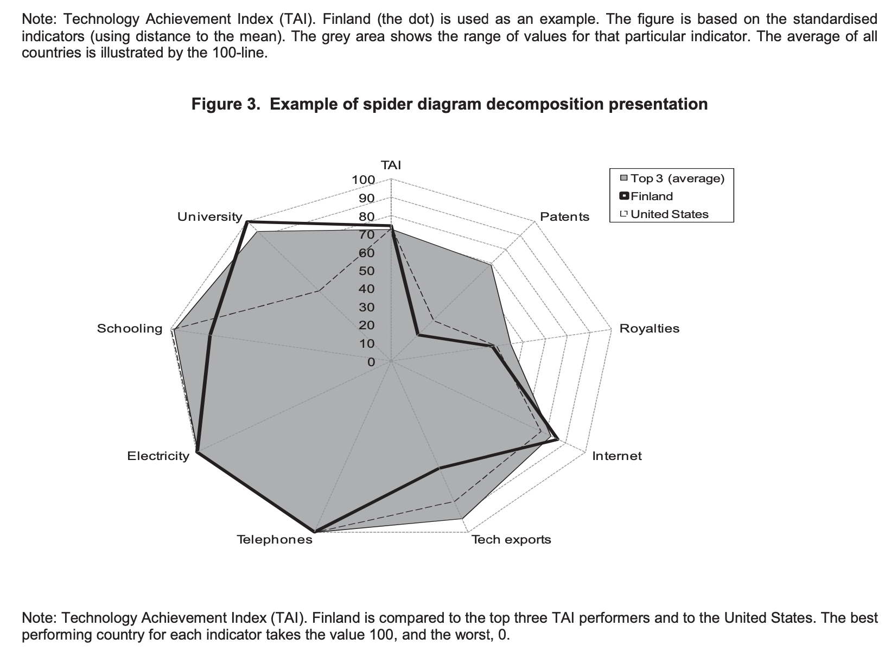

```{r warning=FALSE, message=FALSE, echo=FALSE}
# Work Space preparation
library(tidyverse)
library(data.table)
library(GGally)
library(rmarkdown)

source("tools.R")
```

## Proposed Methodology

* Create Climate Justice Model Criteria from data available
* Ponderate them into a single Climate Justice Indicator
* Analyse correlations between Criteria to justify/understand the outcome

## Load data

```{r message=FALSE}
mjc_prepared <- readRDS("data/mjc_prepared.rds")
mjc_prepared %>% head %>% paged_table
```

## Data for the analysis: Climate Justice Model Criteria.

```{r}
input_regexp <- "MJC" # regular expression to filter data

mjc_analysis_long <- mjc_prepared %>% 
  filter(str_detect(short_name, input_regexp)) %>% 
  arrange(short_name)

mjc_analysis_wide <- mjc_prepared %>% 
  filter(str_detect(short_name, input_regexp)) %>% 
  select(-name, -direction) %>% 
  pivot_wider(c("country", "id", "un_region_name"), names_from = short_name, values_from = value)
```

## Correlation Matrix

### Normality testing

```{r}
mjc_shapiro <- map(mjc_analysis_wide[4:12], shapiro.test)
str(mjc_shapiro)
```


```{r warning=FALSE}
mjc_analysis_wide %>% 
  select(matches(input_regexp)) %>%
  ggpairs(lower = list(continuous = my_fn)) +
  theme(axis.text.x = element_text(size = 8))
```


## Flaws of this approach

Constructing a composite indicator implies 10 steps (OECD, 2008 & Schuschny et.al., 2009):

1. Build the Theoretical Framework
2. Data Selection
3. Imputation of missing data
4. **Multivariate analysis**
5. Normalization
6. Weighting and aggregation
7. Robustness and sensitivity
8. Back to the details
9. Links to other variables
10. Presentation and dissemination 

We have already gone through some of them (1, 2, 4, 6, 9) but not in the correct order.

## Data for the analysis: Variables Used to Construct the Criteria (and others?).

```{r}
input_regexp <- "\\d\\w{1}|MJC9" # regular expression to filter data

mjc_analysis_long <- mjc_prepared %>% 
  filter(str_detect(short_name, input_regexp)) %>% 
  arrange(short_name)
```

```{r warning=FALSE}
mjc_analysis_wide %>% 
  select(matches(input_regexp)) %>% 
  ggpairs(lower = list(continuous = my_fn)) +
  theme(axis.text.x = element_text(size = 8))
```

### Imputation of missing data

```{r}
mjc_analysis_long %>% 
  summarise_statistics(capped = FALSE) %>% 
  select(short_name, name, number_of_observations, missing_data_pctg) %>% 
  paged_table
```

Options to impute missing data:

* Removing instances
* Using statistical methods:
  * GDP per capita: Linear Regression.
  * Poverty ratio under 3.20: To be defined

As a rule of thumb, if a variable has more than 5% missing values, cases are not deleted (Little & Rubin, 2002).

### Multivariate analysis

> The underlying nature of the data needs to be carefully analysed before the construction of a composite indicator. This preliminary step is helpful in assessing the suitability of the data set and will provide an understanding of the implications of the methodological choices, e.g. weighting and aggregation, during the construction phase of the composite indicator. (OECD, 2008).

#### Steps for the Multivariate Analysis:

1. Group information by indicator or by country
2. Perform a PCA **with a correlation analysis as previous step**
3. Perform a Cluster Anlaysis

```{markdown echo=FALSE}
##### Outliers

A correlation analysis implies the **absence of outliers**. 

We should leave some countries outside this analysis to robustly perform the PCA and get sound conclusions out of the process.

##### Data transformations

In the JRC Statistical Audit of the Sustainable Development Goals Index and Dashboards we can read:

> **Potentially problematic indicators** that could bias the overall index results were identified on the basis of two measures related to the shape of the distributions: the skewness and kurtosis.

#```{r}
# mjc_analysis %>%  summarise_statistics(capped = FALSE) %>% paged_table
#```

We would probably need to treat those variables (e.g. with a normalization and a log transformation) before the PCA.
```

At the end of this step we should have:

* Identified sub-groups of indicators or groups of countries that are statistically “similar”.
* Analysed the structure of the data set and compared this to the theoretical framework.
* Documented the results of the multivariate analysis and the interpretation of the components and factors.

### Normalization

Olga did one that we can review. Some other adequated methodologies can be found in the literature.

### Weighting and Aggregation

It is done in the Ponderated Criteria but can be reviewed after doing the full analysis.

### Robustness and sensitivity

How the outcome can change depending on which choices we make during the modelling process.

### Back to the details

> **De-constructing composite indicators can help extend the analysis**



### Links to other variables

In our last meeting we discused about starting here.

### Presentation and dissemination

...
